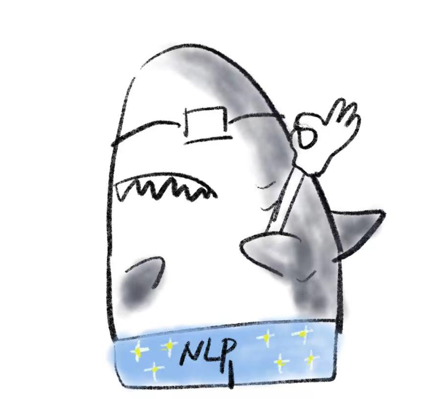
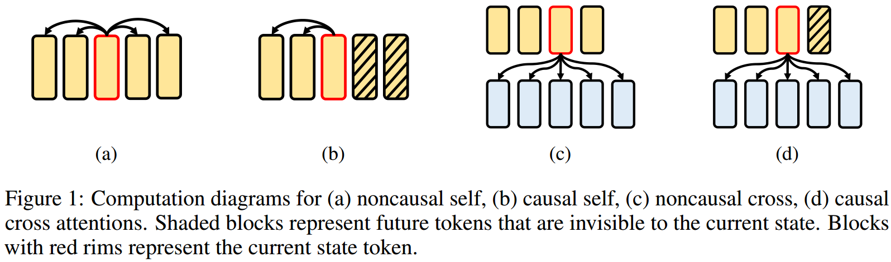
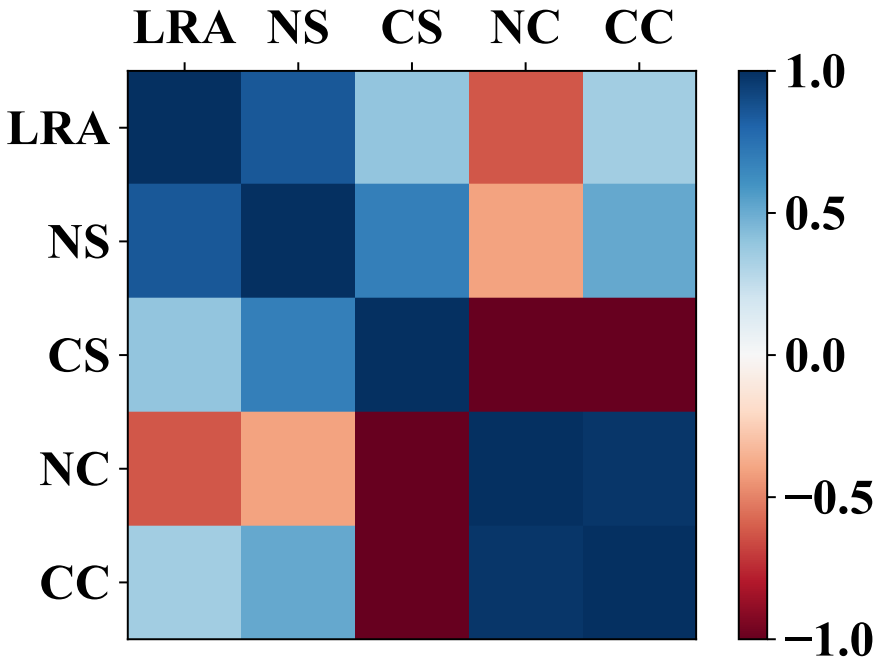
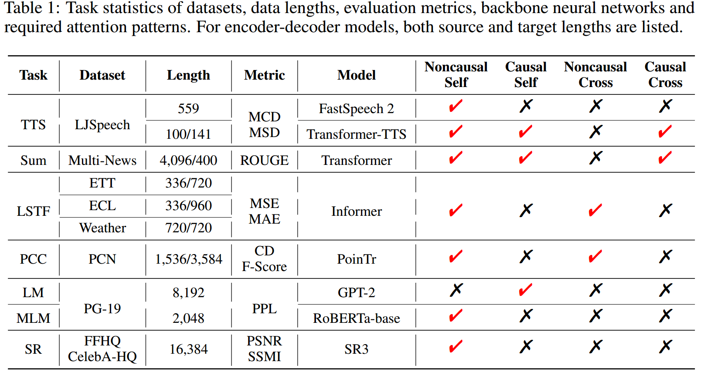
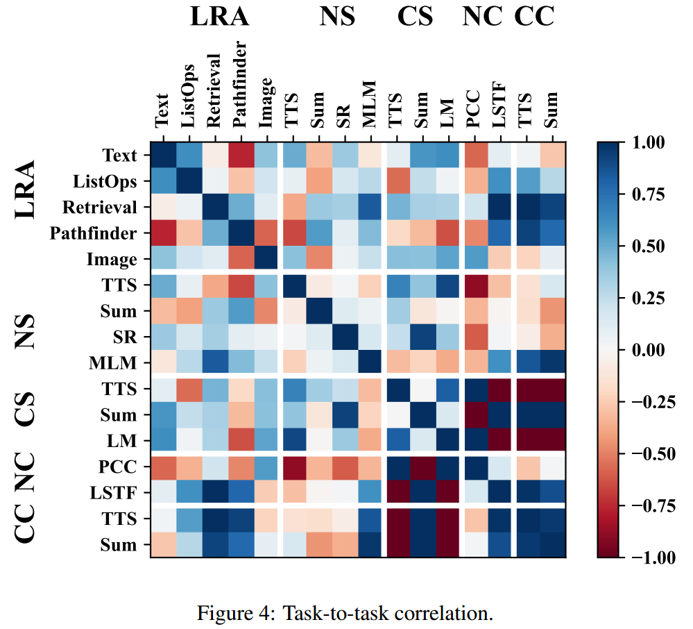
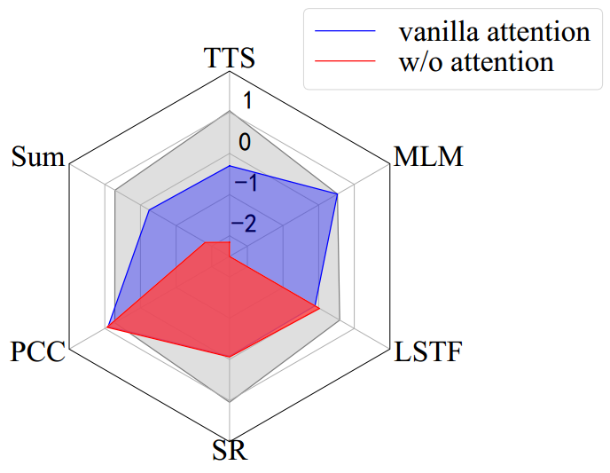
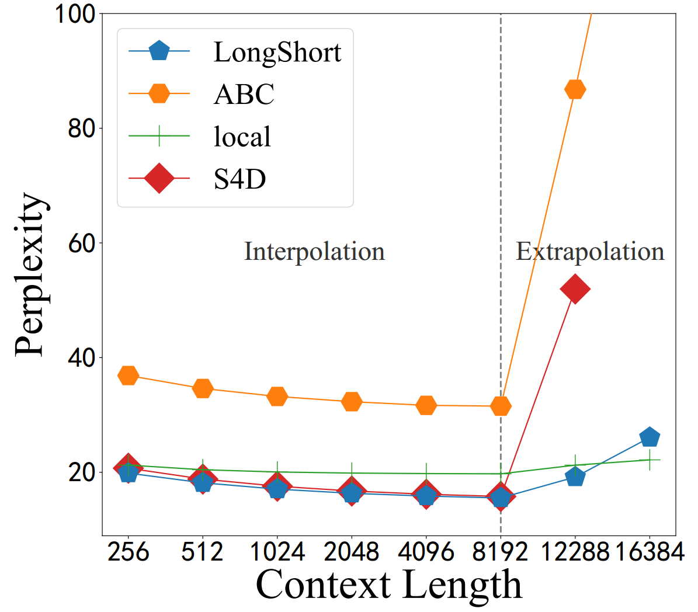

#  Comprehensive Attention Benchmark (CAB)  
CAB aims to provide a comprehensive evaluation of efficient attentions. CAB contains seven real-world tasks from different research areas to evaluate efficient attentions under four fine-grained attention patterns. See our paper *[CAB: Comprehensive Attention Benchmarking on Long Sequence Modeling"](https://arxiv.org/pdf/2210.07661.pdf)* for more details about CAB. 

**We are actively extending CAB with more long range tasks and efficient models, and any suggestion on the suitable tasks and efficient models with reproducible codebases is welcomed. Please send us an email if you have any suggestion on improving CAB. We will buy you a cup of thank you Nayuki (奈雪) or Hey Tea (喜茶) for help improving this work :).**

# Overview
The repository structure is organized as follows:
- `efficient-attention` is a plugin library of efficient attentions, and detailed usage can be found in [efficient-attention](./efficient-attention).
- `tasks` refers to all the long range tasks of CAB with reproducible scripts.
- `scripts` includes useful scripts for efficient attention, such as compositional index calculation and causality test.
- `imgs` contains experimental results of CAB paper.

## Attention Taxonomy
We put forward a `fine-grained` attention taxonomy, considering the conditionality and causality of attentions. Thus we obtain four attention patterns via Cartesian product as `{noncausal, causal} × {self, cross}`: `noncausal self (NS)`, `causal self (CS)`, `noncausal cross (NC)`, and `causal cross (CC)`. Under the taxonomy, we present four attention patterns with different attentive functionality as shown in Figure 1.

<p align="center">

</p>

We investigate whether effcient attentions perform consistently across different attention patterns. We compute `Pearson correlation` between each pair of attention patterns against the same arrangement of effcient attentions for intra-benchmark comparison. In addition, we also calculate the correlation between CAB’s four attention patterns and LRA for inter-benchmark comparison. The pattern correlation are as follows:

<p align="center">

</p>

## Long Range Tasks
We collect seven real-world long-sequence modeling tasks in CAB with data lengths from `300 to 16,000` and include `eight` widely-used models as backbones in CAB to assess typical efficient attention mechanisms. Table 1 summarizes the tasks’ statistics, evaluation metrics, backbone neural networks and the required attention patterns are also checked. We show the environment setup and model training of tasks in [Text-to-Speech Synthesis (TTS)](./tasks/TTS), [Summarization (Sum)](./tasks/Sum), [Long Sequence Time-series Forecasting (LSTF)](./tasks/LSTF), [Point Cloud Completion (PCC)](./tasks/PCC), [Language Modeling (LM)](./tasks/LM), [Masked Language Modeling (MLM)](./tasks/MLM), and [Super-Resolution (SR)](./tasks/SR).

<p align="center">

</p>

We also show the `task correlation` between each pair of tasks in LRA and CAB as follows:
<p align="center">

</p>

# Leaderboard-2022.11.16
We report `compositional index` (`CI`) in the leaderboards. 
`CI` is a normalized score to balance the influence among evaluation metrics, and high `CI` represents excellence. The calculations of `CI` are shown in [`scripts/compositional_index`](./scripts/compositional_index). $\Delta$ indicates the difference value of average `CI` between efficient attention and vanilla attention.

## Noncausal Self Attention
<div align="center">
  
Model           | TTS       | Sum       | SR        | MLM       | Avg.     | $\Delta$
--------------- | --------: | --------: | --------: | --------: | --------:   | :---:
local           | 0.362     | **2.617** | 0.421     | 0.515     | **0.978**   | 1.002
cosFormer       | 0.516     | -0.190    | **1.042** | 0.498     | 0.466       | 0.490
LongShort       | 0.572     | -0.322    | 0.298     | **0.528** | 0.269       | 0.293
_vanilla_         | _-0.301_    | _-0.246_    | _-0.077_    | _0.527_     | _-0.024_      | _0.000_
LARA            | -0.639    | -0.522    | 0.554     | 0.479     | -0.032      | -0.008
Performer       | -0.282    | -0.088    | 0.439     | -1.211    | -0.285      | -0.261
Nyströmformer   | -2.011    | -0.321    | 0.088     | 0.481     | -0.440      | -0.416
ProbSparse      | 0.705     | -0.246    | -0.697    | -2.408    | -0.661      | -0.637
ABC             | 0.043     | -0.678    | -2.525    | 0.414     | -0.686      | -0.662
S4D             | **1.035** | -         | 0.457     | 0.176     | -           | -
  
</div>

## Causal Self Attention
<div align="center">
  
Model           | TTS       | Sum       | LM        | Avg.     | $\Delta$
--------------- | --------: | --------: | --------: |  --------:  | :---:
S4D             | **1.030**     | **1.143**     | 0.780     | **0.985** | -
LongShort       | 0.701     | 0.340 | **0.812** | 0.617     | -
local           | -1.361    | 0.337     | 0.305     | -0.239 | -
ABC             | **0.707** | -1.461    | -1.117    | -0.623 | -
_vanilla_       | _-0.047_  | _0.784_   | -         | -      | -
  
</div>

## Noncausal Cross Attention
<div align="center">

Model           | PCC       | LSTF      | Avg.    | $\Delta$
--------------- | --------: | --------: | --------:  | :---:
_vanilla_       | _0.449_   | _0.744_   | _0.596_    | _0.000_
ABC             | **0.573** | -0.164    | **0.204**  | -0.392
Performer       | 0.473     | -0.445    | 0.014      | -0.582
cosFormer       | -1.496    | **-0.135**| -0.815     | -1.411


</div>

## Causal Cross Attention
<div align="center">

Model           | TTS       | Sum       | Avg.       | $\Delta$
--------------- | --------: | --------: | --------:  | :---:    
_vanilla_       | _1.047_   | _0.867_   | _0.956_    | _0.000_
ABC             | **-0.112**| **0.228** | **0.058**  | -0.898
Performer       | -0.935    | -1.094    | -1.014     | -1.970
  
</div>

# Discussion

## Efficiency Length
We report `effciency length` to measure the utility of effcient attentions. The `efficiency length` is defined as the intersection point of computational time and memory curves by efficient models and vanilla attention. The `efficiency length` represents the minimum length that a sub-quadratic efficient model surpasses vanilla attention in efficiency. 

<div align="center">

Model           | Running Time       | Memory Usage
--------------- | --------:          | --------:
Performer       | 2,361              | **37**
LARA            | 2,541              | 68 
ABC             | **1,877**          | 70
Nyströmformer   | 3,045              | 94
cosFormer       | 2,539              | 164
ProbSparse      | 3,450              | 281
LongShort       | 5,652              | 342
S4D             | 6,011              | 949
local           | 4,195              | 1,169

</div>

## Benefit of Attention

We explore the `benefit of attention` under noncausal self attention pattern. The experimental results are as follows. Results show that attention mechanism improves
performance on most tasks. Embarrassingly, after removing the attention mechanism, the `PoinTr` and `Informer` achieve improvement on `PCC` and `LSTF` tasks, respectively.

<p align="center">

</p>

## Interpolation/Extrapolation on Long-context Language Modeling

We also focus on efficient attention's interpolation/extrapolation capability. On one hand, as the size of context grows to 8,192, language models achieve decreasing perplexity. It means that longer contexts indeed improve language modeling, and effcient attentions do well in interpolation as expected. On the other hand, for sequences with more than 8,192 tokens, the perplexities of all these effcient attention-equipped language models become higher.
<p align="center">

</p>

# Contribution
Please follow the experimental setting to evaluate your method. For the hyperparameters of attention, we hope your method to follow or be similar to our settings, such as the size of the window. Besides, your method should have no more than 10% of the parameters of the backbone model.

**You are welcomed to provide codes and reproducible scripts of your efficient attention models to the efficient attention library. The results of individual tasks and leaderboards will be updated through pull requests. We will review submitted pull requests soon.**

# Citation
```
@article{zhang2022cab,
  title={CAB: Comprehensive Attention Benchmarking on Long Sequence Modeling},
  author={Zhang, Jun and Jiang, Shuyang and Feng, Jiangtao and Zheng, Lin and Kong, Lingpeng},
  journal={arXiv preprint arXiv:2210.07661},
  year={2022}
}
```

